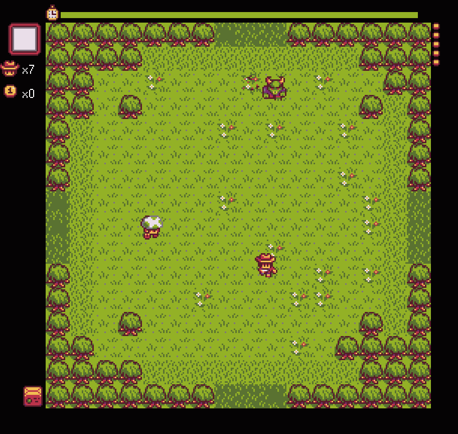
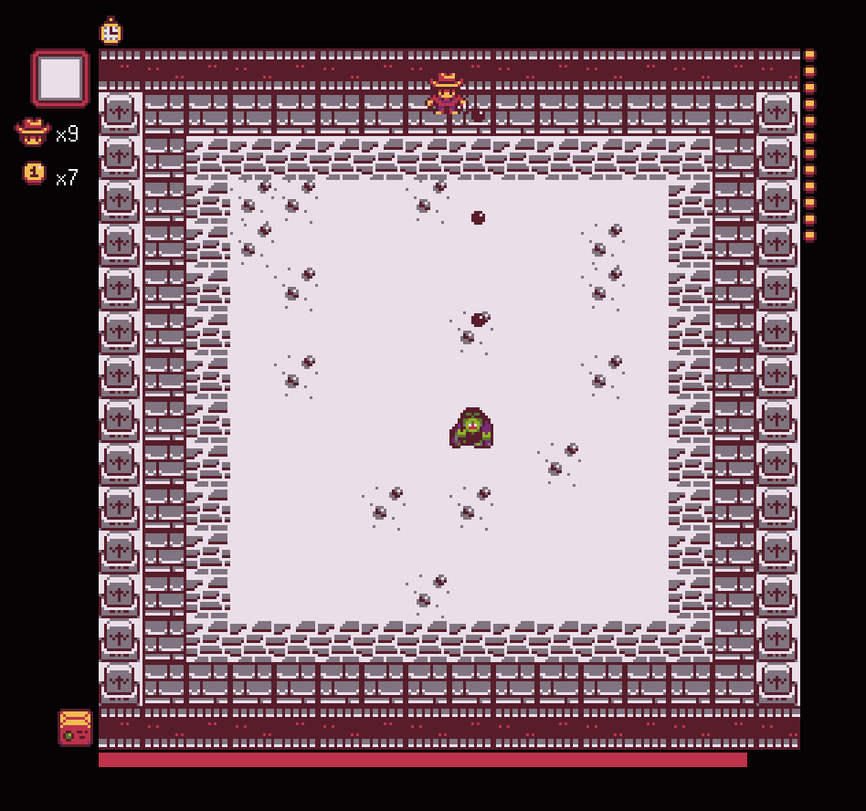
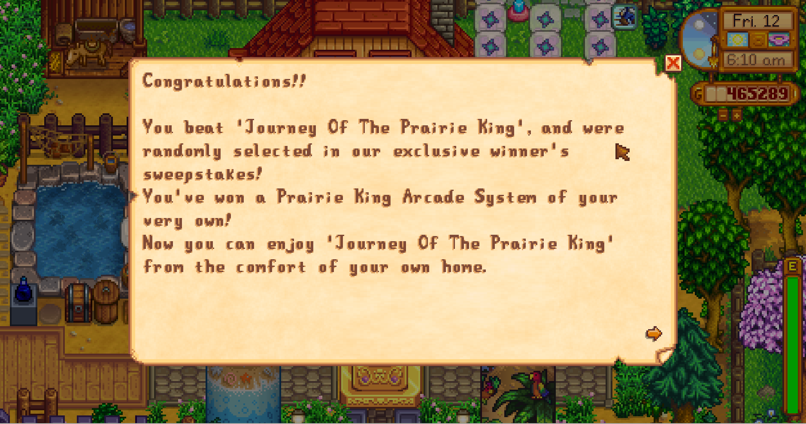
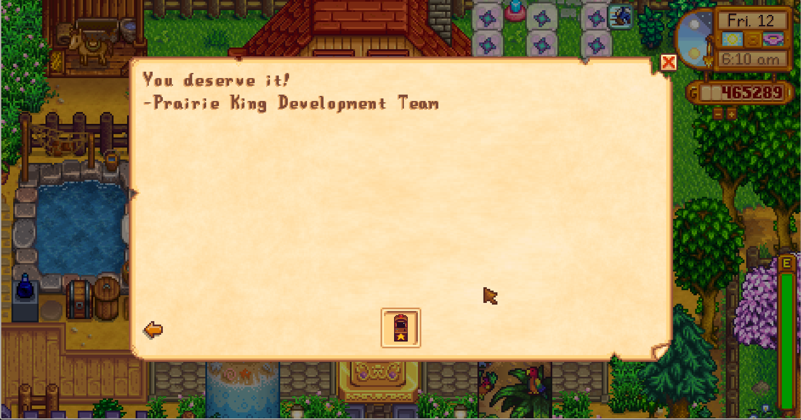

## Introduction

In the Stardrop Saloon, there are two arcade machines, one is Junimo Kart and
Journey of the Prairie King. These two games are not needed for progression or
true perfection but beating JotPK has two Steam achievements. The first one is
beating the game, and the second one is beating the game without dying. But how?
When Abigail first showed me the game, I died in less than thirty seconds.

## Some Background Knowledge You Should Have Acquired Before

There are three stages in the game, which are prairie, forest and graveyard.
The differences are just visual, except rivers and obstacles.
(more on that below).

Use WASD to move and arrow keys to shoot (more on shooting below). Enemies have
HP, and some are pretty "tanky" like mummies. Once you kill them, they drop
nothing or coins or power-ups (next section). Some people say coins are not
important, but I beg to differ. If you cannot get enough coins to buy two
ammunition upgrades, you are doomed since the imps will take two bullets to
kill. Get as many coins as possible, especially the coins which says "5".

## Power-ups

The worth of the power-ups are ordered as follows: Sheriff's Badge is better than
Wagon Wheel; Wagon Wheel is better than Heavy Machine Gun or the Shotgun; And
the two are better than Coffee; Coffee is better than the Smoke Bomb; and
finally the Smoke Bomb is better than Tombstone. Oh, and I forget the Nuke.

### Why not Nuke Everything?

Everything is cleared, but they do not drop anything. You may miss some
sheriff's badge or five coins because of that. Only use it if you are jailed
(surrounded by too many mobs) or you do not need any money.

### What about Smoke Bomb?

It grants you some frames of invisibility, but it teleports you around. What if
it teleports you away from sheriff's badge and place you inside a horde of imps?

### How About the Tombstone?

I found it useless. The monsters are not really moving away from you. You can
touch monsters with that, but I never dare to do so.

### Sheriff's Badge + Wagon Wheel

You are super lucky and invincible for 1/4 time of a round.

## Shop

For levels 1-2, 1-4, 2-1, 2-3, 3-1, 3-3, a vendor will appear and sell you
firearms. Always go for the ammunition upgrade **twice** before buying other
upgrades. **YOU NEED TO ONE SHOT THOSE IMPS**. Speed is not going help you since
they swarm you. Also, if you cannot clear the mummies fast enough, they will
accumulate to occupy the whole arena. Then speed will be useless since
you have nowhere to go.

## Shoot Sideways

Many struggle with this game since they are not reminded that shooting sideways
is possible. For instance, if you want to shoot north-west corner, just hold
left arrow and up arrow **together**. See the picture below:

It is immensely useful to all monsters, especially imps and mushrooms.

## Stage 1 - Prairie

Always stay at the middle! Please do not venture too far into the corners, or
else you will have no path to escape. I do not have an image for that, but
imagine you are in the bottom-left corner, and orcs are pouring in from the west
and south. You have no way to go except navigating through the gaps of the orcs.
Sometimes if they pack-spawn then there will be devoid of space.

Here is a picture showing the centre.

### The Spikyballs

You do not have to kill them unless they are charging against you. Once they are
deployed, they cannot move. Eliminate the orcs first.

## Stage 1-4

People always say this is the easiest stage, but I always ended dying at least
once when there is an influx of mobs to the fort. Nevertheless, try to say
inside the fort and try not to venture out to obtain useless power-ups. If you
have wagon wheel then you are basically invincible.

Another tip: sometimes do not kill the ogres right away since they can block the
entrance for you.

### Stage 1-4 Shop

Please buy the first ammo upgrade. If not, those mushroom will be extra nasty to
clear.

## Stage 1 Boss

This boss is very easy. You can shoot it sideways just like the image below:

Also, when you kill the boss, do not forget to take the extra life before you
ride the mount(?).

## Stage 2 - Forest

Those mushrooms have the speed of lightning. Shoot diagonally. Avoid racing with
them; they always win. Priorities mushroom before ogres. Anything that is slow
has minuscule potential to kill you. In general, kill anything that is speedy
first.

A familiar tip: The ogres can block the mushrooms too. And you may have guessed
it: the imps can be blocked by mummies.

### 2-2 Obstacles

Please do not lock yourself inside the obstacles. You deserve dying if you do
so. See the image below:

### 2-3 River

Although rivers are useless to butterflies, they are effective against mushroom
boys. The best aspect about rivers is that they do not block bullets. Always
shoot the mushrooms like that.

Look at the annotations below. From my experience, staying at the corners are
the safest. The worst aspect of staying in the dead centre is that monsters will
pour in from all directions.

Am I a hypocrite, giving that I have told you stay in the centre just now? The
reason is given by the special design of this area. The rivers not only blocks
the movement of monsters, but also the player. If you are evacuating from a pack
of mushrooms, then you are forced to share the same bridge with them. Never race
with mushrooms.

### 2-3 Shop

At this time, you should have saved 30 coins for the second ammo upgrade. If you
failed to gather the coins, then those two-hit-kill flying demons will
embrace and extinguish you.

If you want to be safe during the third stage, consider restarting the game.
Maybe this time enough coins may be earned so that you can afford it.

### 2-4 Boss

From my experience, this boss is able to shoot sideways just like the player.
However, his movements are predictable so with some practice you can lose no
lives.

This photo shows a **wrong position**. You should not be **aligned with any boss**. Instead, you should nudge slightly so that your bullet can hit him but his bullet cannot. I probably have mentioned it too many times...

## 3 - Graveyard

No adequate vocabulary can describe the frustration and abomination of this
level. Not only it gives mummies a whooping six hitpoints, but fiery red imps
that can rip your internals. I hate to recapitulate, but if you did not possess
a second ammo upgrade, the demons will be worse than your most terrifying
nightmare. They are agile and nimble and cruel and ruthless and erratic. Mummies
on the other hand are a piece of cake, but even a second ammo will take two hits
to kill. Always kill those hellish imps before mummies.

### 3-2 Do Not Stay Inside the Graves

Same story as in 2-2. The escape routes will be blocked by the graves. This is
also why we must not place miscellaneous immovable heaps of junk at the stairs
of your flat. Where could you go if there is a fire? Firemen may not be
quick enough to rescue you.

### 3-3 Your Worst Nightmare

At this time dying is not a big deal unless you are striving for Fector's
Challenge. Leave some lives for the final boss though.

### Final Box Fight

There is an easy way to cheese Fector. Go back and nudge yourself slightly
away from Fector, so that his bullets cannot hit you but yours can. See [this
video](https://youtu.be/FfIGjWicrK4) if you are unsure.

He is also able to spawn mobs and shoot from all eight directions. Even though
he is invisible, he is not invincible. Do not move and keep shooting him. Only
move if mobs get too close. When the mobs are dead, swiftly realign yourself to
the cheese position. Fector will be dead by no time.

## Spoiler: What Happens if You Beat Fector?

A lovely scene will appear. The player will grab the heart and give it to his
lover(?). They hug(?) and the game ends. "The End" will be shown, and you can
play hard mode. Who has the time to play that though?

The Prairie King Arcade System will send you the same type of machine that you
want to smash to smitheries the next day.

## Misc: Can I Cheese Fector's Challenge?

Stardew Valley has a peculiar feature: you can only save a day's progress. I
(previously) hate this feature, but it can be exploited. If you have completed a
level without dying, go back to sleep. Play the next level after you have wakened
up. If you lose a life, exit to menu and re-join. Repeat until you have beaten
it. Go back to sleep. Do this until you beat Fector.
